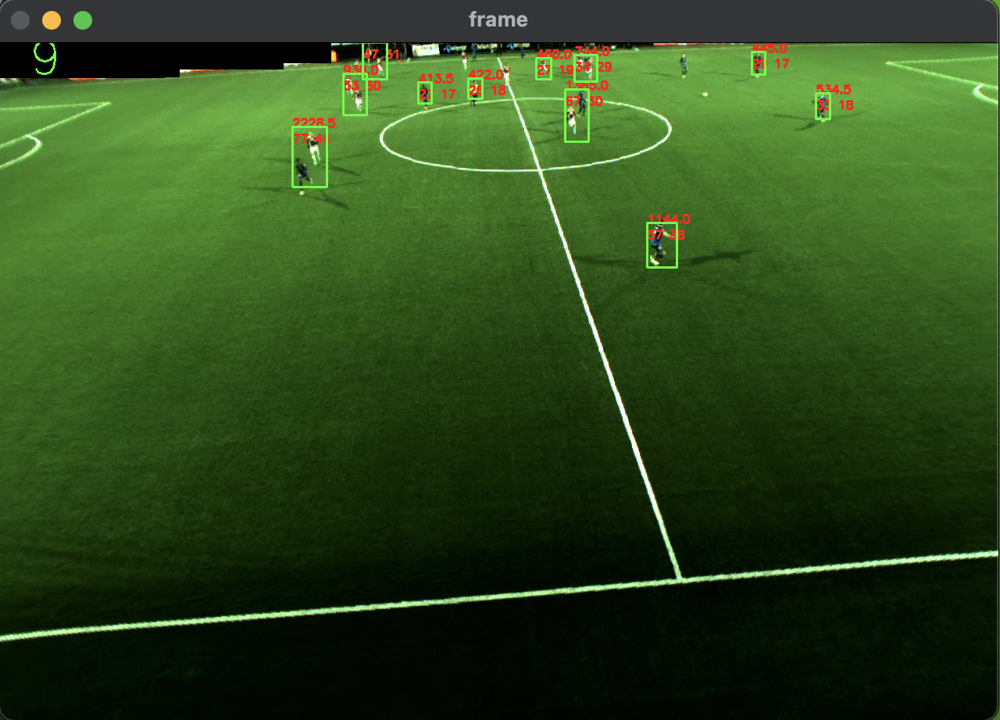
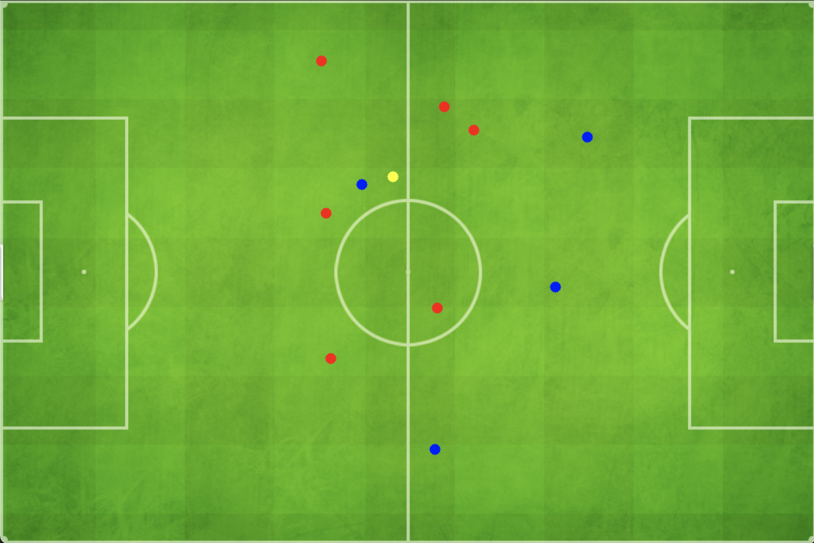
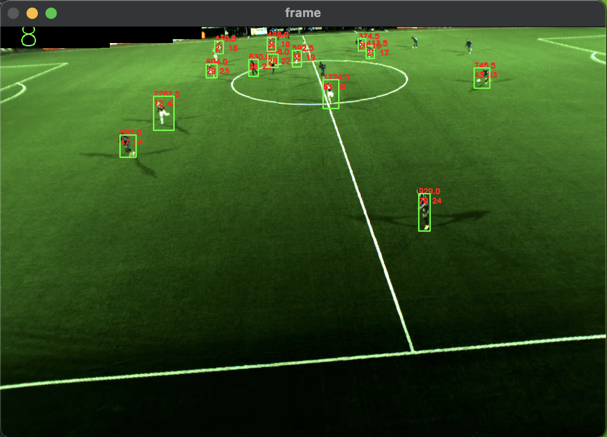
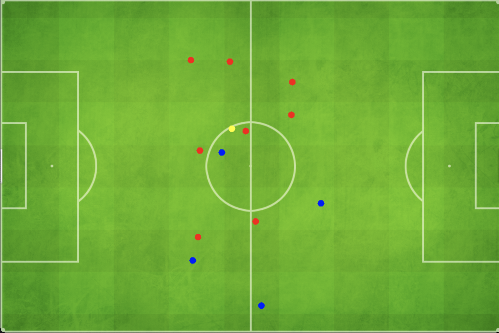

# football_player_tracking

In this Repo, we have provided the tracking of football players using background subtraction and classifying them using a neural network.

## Start
```bash
    python3 -m venv env # or you can use virtual env but python3 is requred
    source ./env/bin/activate

    pip install -r requirements.txt

    python main.py
```

## Outputs

### sample 1

#### detection
- 


#### classification

- 


### sample 2

#### detection

- 


#### classification
- 



### sample 3 

